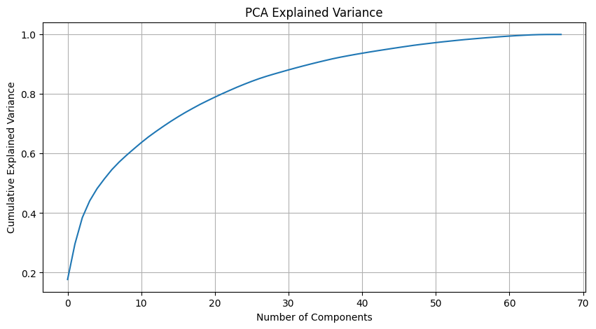
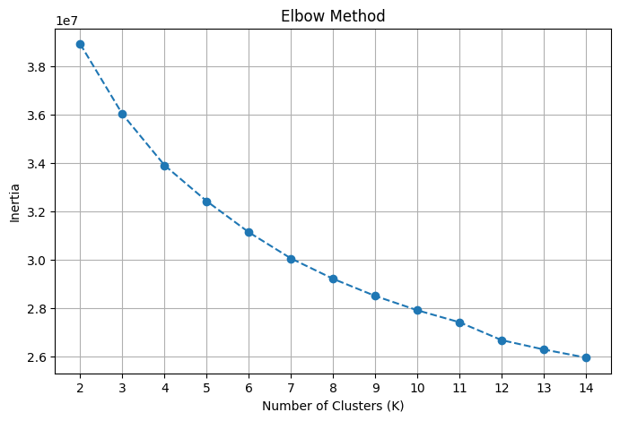
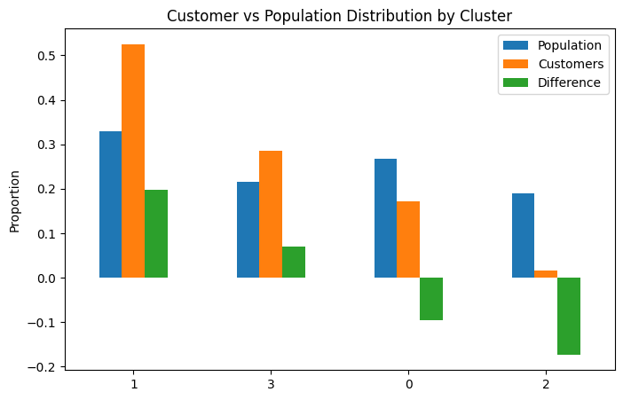

# Customer Segmentation using Unsupervised Learning

> **Key Insight:**  
> Customers are not the wealthiest segment — they are primarily value-conscious and digitally engaged individuals.

---

## Overview

This project applies unsupervised learning techniques to segment a population dataset and analyze how a mail-order company's customers map to those segments.

The objective is to identify:
- Which demographic segments are most likely to be customers  
- Which segments are underrepresented  
- What characteristics define these groups  

---

## Problem Statement

Given:
- A general population dataset  
- A customer subset dataset  

The goal is to:
1. Identify natural clusters in the population  
2. Map customers to these clusters  
3. Analyze differences to uncover target segments  

---

## Approach

The project follows a structured machine learning pipeline:

### 1. Data Cleaning & Feature Engineering
- Standardized missing values (`-1`, `0`, `X`, `XX` → `NaN`)
- Removed high-missing columns
- Engineered meaningful features:
  - `CAMEO_WEALTH`, `CAMEO_INTL_WEALTH`
  - `YOUTH_MOVEMENT`, `YOUTH_REGION`
  - `AGE`, `BUILDING_AGE`

---

### 2. Feature Transformation
- Imputed missing values using median
- Scaled features using `StandardScaler`

---

### 3. Dimensionality Reduction (PCA)
- Reduced dimensionality while preserving ~85% variance
- Key components captured:
  - **PC1:** Socioeconomic status & urban density  
  - **PC2:** Lifestyle (traditional vs modern)  
  - **PC3:** Personality traits  

---

### 4. Clustering (KMeans)
- Evaluated multiple values of K using:
  - Elbow method  
  - Silhouette score  
- Selected **K = 4** for optimal balance  

---

### 5. Customer Mapping
- Applied identical preprocessing pipeline  
- Transformed using trained scaler and PCA  
- Assigned clusters using trained KMeans model  

---

## Key Visualizations

### PCA Explained Variance


### Elbow Curve


### Customer vs Population Distribution


---

## Key Insights

### Overrepresented Segments (Core Customers)

**Cluster 0**
- Lower income, urban population  
- High mobility, financially constrained  

Strong alignment with value-conscious consumers  

---

**Cluster 3**
- Financially disciplined (savers/investors)  
- Traditional mindset  
- High online engagement  

Digitally engaged and financially aware customers  

---

### Underrepresented Segments

**Cluster 1**
- Affluent households  
- Larger homes, suburban profiles  

Wealthy individuals are not the primary customer base  

---

**Cluster 2**
- Wealthy families and homeowners  
- Lower online engagement  

Less responsive to digital channels  

---

## Business Implications

- Customer base is **not driven by wealth alone**
- Strong alignment with:
  - Value-conscious consumers  
  - Digitally engaged users  

### Opportunities:
- Focus on affordability-driven messaging  
- Strengthen digital acquisition channels  
- Explore strategies to attract affluent segments  

---

## Technical Highlights

- Built a reusable preprocessing pipeline (`clean_data`)
- Maintained consistency between training and inference
- Interpreted PCA components for explainability
- Combined clustering with business interpretation  

---

## How to Run

Clone the repository: 
```bash
   git clone <your-repo-url>
   cd customer-segmentation```
   
Install dependencies
```bash
pip install -r requirements.txt
```

Launch Jupyter notebook
```bash
jupyter notebook
```

Open
```
notebooks/Identify_Customer_Segments.ipynb
```

---

## Dataset
Dataset is not included due to licensing restrictions.

Please obtain it from Udacity project resources.

---

## Key Learnings

- Importance of data processing in unsupervised learning
- Interpreting PCA beyond variance explained
- Trade-offs in clustering (interpretability vs granularity)
- Real-world challenges in maintaining pipeline consistency

---

## Contact

If you'd like to discuss this project, feel free to reach out.